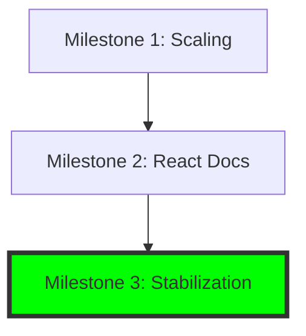

# Project State: Synapse

## Project Reference
**Core Value**: Unified context layer (Code, KG, Memory) for AI agents.
**Current Focus**: Stabilization and Release (Milestone 3).

## Current Position
**Phase**: Milestone 3: Stabilization & Release
**Plan**: Completed
**Status**: Completed

## Performance Metrics
- **76/76** MCP tools active.
- **0.3.2** current version (stabilized).
- **0** pending critical issues.

## Accumulated Context
### Decisions
- [2026-04-30] Initiated Milestone 3 to address critical installation and runtime issues found in testing.
- [2026-04-29] Fixed global 'synapse' command and Windows doctor diagnostics.
- [2026-04-29] Repaired stress-synapse.mjs and standardized release-check script.
- [2026-04-29] Unblocked release gate with 6/6 passing criteria.

### Todos
- [x] Fix global `synapse` command shims (M003-01)
- [x] Repair installed-runtime MCP sweep (M003-02)
- [x] Correct Windows doctor npm/npx detection (M003-03)
- [x] Fix CLI help behavior for doctor/selftest (M003-04)
- [x] Update stress script for new architecture (M003-05)
- [x] Standardize release script execution (M003-06)
- [x] Pass final release exit criteria (M003-07)

## Session Continuity
**Last Action**: Completed Milestone 3: Stabilization & Release.
**Next Step**: Milestone Audit and final cleanup.
