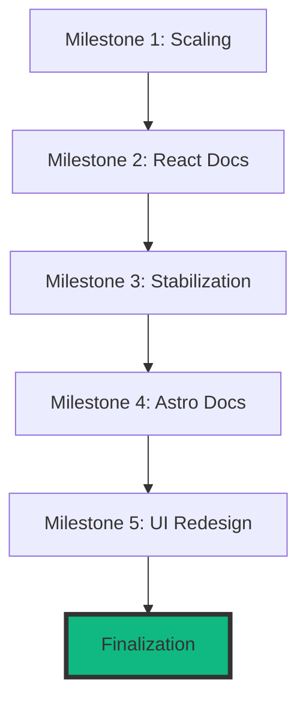

# Project State: Synapse

## Project Reference
**Core Value**: Unified context layer (Code, KG, Memory) for AI agents.
**Current Focus**: Finalization & Release.

## Current Position
**Phase**: Complete
**Plan**: All Milestone Phases Executed
**Status**: Ready for Release

## Performance Metrics
- **76/76** MCP tools active.
- **0.0.1-beta** current version (consistent with release target).
- **0** pending critical issues.

## Accumulated Context
### Decisions
- [2026-05-01] Reverted version to `0.0.1-beta` for release consistency across all artifacts.
- [2026-05-01] Completed interactive UI Redesign (Milestone 5) with Aceternity components.
- [2026-05-01] Refactored `index.mdx` to use encapsulated `NeuralEngine` component, resolving React hydration build errors.
- [2026-04-30] Removed Docusaurus site and replaced with Astro Starlight to align with original NEW_DOCS_PLAN.md.

### Todos
- [x] Fix global `synapse` command shims (M003-01)
- [x] Repair installed-runtime MCP sweep (M003-02)
- [x] Correct Windows doctor npm/npx detection (M003-03)
- [x] Fix CLI help behavior for doctor/selftest (M003-04)
- [x] Update stress script for new architecture (M003-05)
- [x] Standardize release script execution (M003-06)
- [x] Pass final release exit criteria (M003-07)
- [x] Audit and Cleanup (M005-Final)

## Session Continuity
**Last Action**: Completed Milestone 5 and version consistency audit.
**Next Step**: Project handover / final cleanup.
