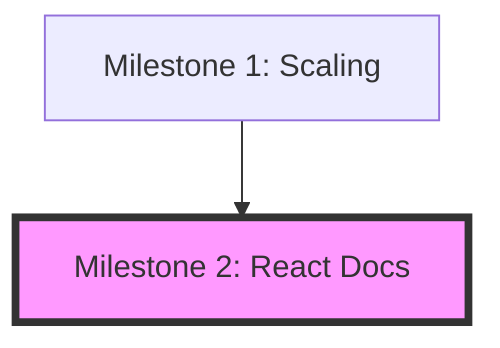

# Project State: Synapse

## Project Reference
**Core Value**: Unified context layer (Code, KG, Memory) for AI agents.
**Current Focus**: Improving retrieval relevance via local LLM enrichment.

## Current Position
**Phase**: Milestone 2: React Documentation Site
**Plan**: Phase 3: Integration & Polish
**Status**: Ready for Execution

## Performance Metrics
- **74/74** MCP tools active.
- **0.3.2** current version.
- **1** new requirement area (React Ecosystem).

## Accumulated Context
### Decisions
- [2026-04-28] Transitioned to Milestone 2: React Documentation Site.
- [2026-04-28] Selected Docusaurus as the React framework for official documentation.
- [2026-04-29] Completed Phase 1: Foundation & Setup.
- [2026-04-29] Completed Phase 2: Content Migration & MDX.
- [2026-04-30] Planned Phase 3: Integration & Polish.

### Todos
- [x] Initialize Docusaurus in `docs/`
- [x] Add `npm run docs:dev` to root `package.json`
- [x] Port existing Markdown documentation to MDX (02-02-PLAN)
- [x] Implement interactive React components in docs (02-02-PLAN)
- [ ] Finalize theme adjustments and brand polish (02-03-PLAN)
- [ ] Verify production build success (02-03-PLAN)

## Session Continuity
**Last Action**: Created Phase 3 Execution Plan (02-03-PLAN.md).
**Next Step**: Execute Phase 3.
