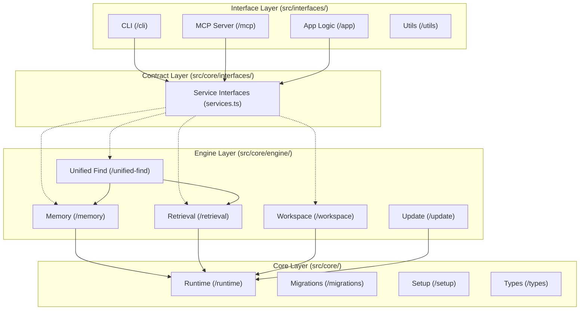

# Synapse Architectural Overview

This document outlines the high-level architecture mapped across the `src/` directory. Synapse follows a Domain-Driven, multi-layered architectural approach to strictly separate basic core utilities from business logic and application boundaries.

## Top-Level Domains

Synapse follows three immutable pillars:

1. **`src/core/interfaces/`** (Contracts & Abstractions)
2. **`src/core/`** (Engine Implementation & Infrastructure)
3. **`src/interfaces/`** (Entrypoints & I/O)

---

### 1. Hardened Foundations (v0.0.1-beta.3)

#### 1.1 Dependency Inversion (DIP)
All external entrypoints (CLI, MCP) now depend exclusively on the **Contract Layer** (`src/core/interfaces/services.ts`). This allows for:
- **Testability**: Easy mocking of core services.
- **Flexibility**: Implementation swapping without touching the interface layer.
- **Stability**: Elimination of "God Object" dependencies and circular imports.

#### 1.2 DSA & Performance Optimization
- **AST Parsing**: Implemented `WeakMap`-based memoization for AST node lookups. The complexity of resolving scope paths has been reduced from **O(N²)** to **O(N)** amortized, ensuring ultra-fast indexing of large codebases.
- **Power Controllers**: Centralized 72+ granular MCP tools into ~14 high-density "Power Controllers" using flat JSON objects. This architectural shift ensures **Gemini/Vertex AI compatibility** while maximizing context window efficiency for all LLMs.
- **Response Mapping**: Centralized tool I/O via `McpResponseMapper` ensures consistent, token-optimized responses across all controllers.

---

### 2. Core Engine (`src/core/engine/`)
The bounded business logic contexts. Each engine domain is as isolated as possible and handles a specific part of the AI brain's logic.

- **`/memory`**: The intelligent persistent knowledge graph logic, split internally between `store`, `temporal`, `backfill`, `audit`, etc.
- **`/retrieval`**: Handles code search, text embeddings, BM25 indexing, and vector similarity querying.
- **`/workspace`**: Directory lifecycle management and project boundaries.
- **`/update`**: Over-the-air update mechanisms to pull new CLI versions via npm.
- **`/unified-find`**: Highly advanced search synthesis across memory, retrieval, and temporal layers.
- **`/database`**: Co-ordinates low-level SQLite primitives and node:sqlite integration.

### 3. Runtime & Setup (`src/core/runtime/` & `src/core/setup/`)
The foundation of Synapse. The Core context manages configurations, environment constraints, early lifecycle events, and overarching data types.

- **`/runtime`**: Environment constraints, feature toggles, SQLite core layout/extensions, and diagnostics.
- **`/setup`**: Orchestrator utilities for initializing Synapse on first run.
- **`/migrations`**: Database schema evolution and configuration migrations.

### 4. Interfaces (`src/interfaces/`)
The external boundaries where the outside world interacts with Synapse. These orchestrate the engine domains and consume runtime utilities, acting entirely as wrappers/adapters.

- **`/cli`**: Local human-in-the-loop interaction layers. Responsible for arg parsing, ANSI outputs, spinners, etc.
- **`/mcp` & `/app`**: Exposes Synapse as a Model Context Protocol (MCP) server for Claude/VSCode to consume autonomously. Holds tool registrations and STDIO/SSE lifecycle routing.
- **`/utils`**: High-level interface utilities, including the `McpResponseMapper` for context-optimized tool output.

---

### Development Principles

- **Downwards Isolation**: `interfaces/` depends on `core/interfaces/`. `engine/` implements `core/interfaces/`. `core/` depends on `runtime/`. `runtime/` depends on nothing inside the project.
- **Explicit Contracts**: No "any" casts or direct engine instantiation in tools. Always use the `CoreServiceRegistry` and the defined interfaces.
- **No Side-by-Side Sprawl**: Features are kept structurally flat inside their specific domains. Single-file exports or barrel files are preferred over heavily nested monolithic files.
- **Barrel Files**: High-complexity directories like `src/core/engine/memory` expose external APIs solely via an `index.ts`.
