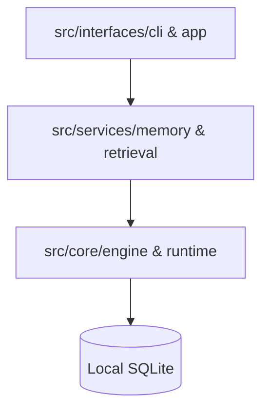

<!-- generated-by: gsd-doc-writer -->

# Architecture Overview

Synapse follows a strictly decoupled, Domain-Driven architectural approach. This ensures that core system fundamentals remain isolated from business logic and external interface boundaries.

## The Three Immutable Domains

The codebase is organized into three distinct layers, with a strict downward-only dependency rule.

### 1. Core (`src/core/`)
The foundation of the system. Core manages configurations, database primitives, early lifecycle events, and universal data types. 
*   **Isolation**: Core should never depend on `services` or `interfaces`.
*   **Engine**: Orchestrates high-level SQLite primitives and extensions (like `sqlite-vec`).
*   **Runtime**: Handles environment constraints and feature toggles.

### 2. Services (`src/services/`)
The bounded business logic contexts. Each service represents a specific domain of the AI brain's logic.
*   **Dependency**: Services depend on `core` but never on `interfaces`.
*   **Memory Service**: Manages the persistent knowledge graph, including temporal tracking and auditing.
*   **Retrieval Service**: Handles AST-aware code search, text embeddings, and vector similarity.
*   **Unified Find**: A high-level synthesizer that coordinates searches across both memory and retrieval layers.

### 3. Interfaces (`src/interfaces/`)
The external boundaries where humans or AI agents interact with Synapse.
*   **CLI**: Human-in-the-loop interaction layer (ANSI output, spinners, arg parsing).
*   **MCP / App**: Exposes Synapse as a Model Context Protocol (MCP) server for Claude/Cursor. Holds tool registrations and lifecycle routing.

## Development Principles

*   **Downwards Isolation**: The system is designed to be highly modular. By ensuring that `interfaces` consume `services` which in turn consume `core`, we prevent circular dependencies and "spaghetti code."
*   **Flat Feature Structure**: Features are kept structurally flat inside their specific domains. Barrel files (index files) are used to expose clean, stable APIs for external consumption while hiding implementation complexity.
*   **Local-First Priority**: Every architectural decision favors local execution over cloud dependencies. SQLite is the primary source of truth for all metadata and memory.

## Dependency Graph

---

**Learn More:**
*   Explore the **[Code Intelligence](/pillars/intel)** layer.
*   Understand the **[Temporal Graph](/pillars/temporal)** implementation.
