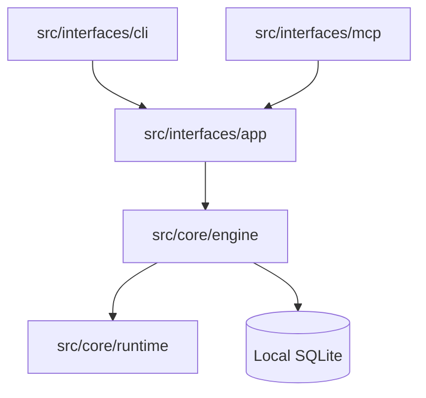

# Architecture Overview

Synapse is a local MCP server with a layered TypeScript architecture. The design keeps runtime primitives, storage, retrieval, and protocol interfaces separated so the project can evolve without coupling every feature to the MCP surface.

## Core Layers

### 1. Core Runtime (`src/core/runtime/`)

Runtime modules handle configuration, platform behavior, diagnostics, version metadata, and SQLite extension loading.

### 2. Core Engine (`src/core/engine/`)

The engine contains the product behavior:

- **Memory**: Persistent semantic memory, event capture, and knowledge graph integration.
- **Retrieval**: Hybrid search, AST chunking, symbol extraction, and vector indexing.
- **Workspace**: Project root discovery and workspace-level metadata.
- **Update**: Upgrade assistant and release support.

### 3. Interfaces (`src/interfaces/`)

Interfaces expose the engine through stable entry points:

- **CLI**: Setup, doctor, backup, memory, ingest, and operational commands.
- **MCP**: Tool registration, request normalization, and protocol response shaping.
- **App assembly**: Runtime composition for the MCP server.

## Development Principles

- **Local first**: SQLite and local filesystem data are the source of truth.
- **Thin interfaces**: CLI and MCP code should delegate to core engine services.
- **Stable tool contracts**: MCP tool inputs and outputs should remain predictable.
- **Focused modules**: Features should live near their domain rather than in broad utility buckets.

## Dependency Shape

---

**Learn More:**

- Explore the **[Code Intelligence](intel)** layer.
- Understand the **[Temporal Graph](temporal)** implementation.
